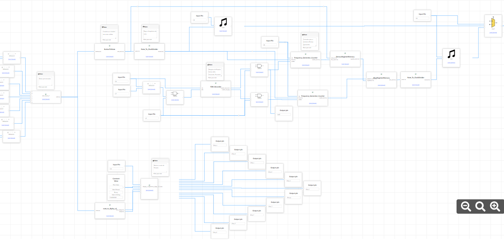
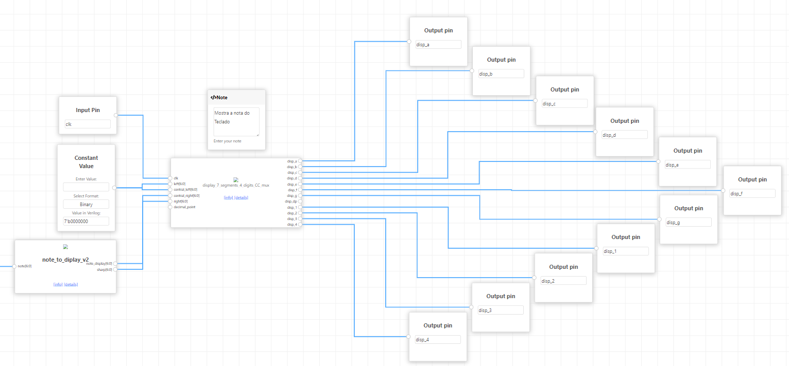

# Autores

- André Luiz Santos Messias ([andre.messias@usp.br](mailto:andre.messias@usp.br))  
- Mateus Santos Messias ([mateus.messias@usp.br](mailto:mateus.messias@usp.br))  
- Pedro Borges Gudin ([pedro.gudin@usp.br](mailto:pedro.gudin@usp.br))

# MID-Keyboard
*Não é um dispositivo MIDI completo, mas utiliza conceitos semelhantes.*

---

# Projeto "Teclado MID"

    

---

## **Sumário**
1. [Introdução](#introdução)  
2. [Funcionalidades Implementadas](#funcionalidades-implementadas)  
   - [Mapeamento de Frequências Inspirado no Formato MIDI](#mapeamento-de-frequências-inspirado-no-formato-midi)  
   - [Sistema de Loop com Gravação e Reprodução](#sistema-de-loop-com-gravação-e-reprodução)  
   - [Identificação das Notas no Display de 7 Segmentos](#identificação-das-notas-no-display-de-7-segmentos)  
   - [Combinações de Notas com Multiplexador](#combinações-de-notas-com-multiplexador)  
   - [Botão como Switch](#botão-como-switch)  
3. [Descrição Técnica](#descrição-técnica)  
4. [Conclusão](#conclusão)  
5. [Melhorias Propostas](#melhorias-propostas)

---

## **Introdução**

#### Nosso objetivo com o projeto foi expandir as funcionalidades do **pianinho** original, transformando-o em um teclado mais versátil e interativo. Para isso, implementamos diversas features que vão desde o mapeamento de frequências no formato MIDI, a adição de sustenidos, até a gravação e reprodução de sequências musicais.

---

## **Funcionalidades Implementadas**

### **Mapeamento de Frequências Inspirado no Formato MIDI**
- Cada nota tocada no teclado é representada por uma mensagem no estilo do protocolo MIDI:
  - **4 bits para Frequência**: Representa a nota específica (até 16 notas diferentes).
- Esse mapeamento permite uma representação compacta e padronizada das notas, facilitando futuras integrações com sistemas MIDI.

---

### **Sistema de Loop com Gravação e Reprodução**
- O oitavo botão do teclado ativa o modo de gravação:
  - Ao pressionar o botão pela primeira vez, o sistema começa a gravar as mensagens MIDI geradas pelas notas tocadas.
  - Ao pressionar novamente, o sistema para a gravação e inicia a reprodução automática da sequência gravada.
- Abaixo há um diagrama ilustrando a lógica de gravação e reprodução:

    

- As mensagens são armazenadas em blocos registradores com uma taxa de amostragem específica. Isso significa que os eventos são registrados em intervalos regulares para garantir a precisão temporal durante a reprodução.

---

### **Identificação das Notas no Display de 7 Segmentos**
- As notas tocadas são identificadas e exibidas em tempo real no display de 7 segmentos.
- Isso fornece feedback visual imediato ao usuário, mostrando qual nota está sendo tocada.

    

---

### **Combinações de Notas com Multiplexador**
- Em vez de uma porta OR, foi implementado um **multiplexador** que permite duas ações simultâneas:
  1. A reprodução das notas previamente gravadas (quando o sistema está em modo de reprodução).
  2. Tocar novas notas em tempo real.
- Dessa forma, é possível combinar sinais tanto do que foi gravado quanto do que o usuário está tocando no momento.

---

### **Botão como Switch**
- O **botão 8** funciona como um **switch** e a lógica está inclusa internamente ao módulo **FSM_Recorder**:
  - Cada pressionamento alterna o estado lógico (`IDLE` ↔ `RECORDING` ↔ `PLAYBACK`).
  - Esse estado aciona o modo de gravação/reprodução e pode ser utilizado para outras funcionalidades no circuito.

    

---

## **Descrição Técnica**

### **Fluxo de Dados**
1. **Gravação**:
   - Os eventos MIDI (`Note On`, `Note Off`) são capturados e armazenados nos registradores.
   - Cada evento inclui um timestamp, a nota tocada e o status.
2. **Reprodução**:
   - Os eventos gravados são lidos sequencialmente dos registradores e reproduzidos no buzzer (ou saída de áudio).
3. **(Futuro) Envio via UART**:
   - As mensagens gravadas poderão ser transmitidas para dispositivos externos usando o protocolo UART.

### **Módulos Principais**
- **Divisor de Clock**: Reduz a frequência do clock principal para uma taxa de amostragem adequada.
- **Gravador de Notas**: Gerencia a gravação e reprodução dos eventos MIDI.
- **Display de 7 Segmentos**: Exibe as notas tocadas em tempo real.
- **Multiplexador**: Combina sinais de áudio gravados e notas tocadas simultaneamente.
- **FSM_Recorder**: Lógica de estado que controla o modo de gravação/reprodução usando o botão 8 como switch.

---

## **Conclusão**
- Conseguimos expandir as funcionalidades do projeto, tornando-o mais do que um simples teclado.
- O usuário pode:
  1. **Gravar e reproduzir** sequências musicais.
  2. **Exibir as notas** em tempo real no display de 7 segmentos.
  3. **Combinar** reprodução gravada e novas notas através do multiplexador.
- O nome “MID” refere-se não só ao protocolo MIDI, mas também ao caráter intermediário do projeto, servindo como uma introdução educativa ao mundo musical digital.

### Sobre a plataforma Chip Inventor
- Visualização clara das conexões: facilitou a compreensão do circuito a ser sintetizado.
- Colaboração e reutilização de blocos: acelerou o desenvolvimento e reduziu a curva de aprendizado.
- Foco no diferencial do projeto: permitiu otimizar tempo e esforços nas inovações.

---

## **Melhorias Propostas**
- **Envio de Mensagens via UART**: implementar o envio das mensagens MIDI gravadas para um computador ou outro dispositivo externo, permitindo salvar as sequências criadas para uso posterior ou processamento adicional.
- **Habilidade de selecionar mais de um bloco** no editor do Chip Inventor (duplicar, etc.).
- **Documentação mais clara** sobre cada módulo implementado.
- **Nomenclatura melhor padronizada** nos módulos e sinais do projeto.
- **Erros na simulação**: investigar a causa e corrigir discrepâncias entre a simulação e o hardware real.
- **Possibilidade de colaboração simultânea** no Chip Inventor, não apenas visualização.
