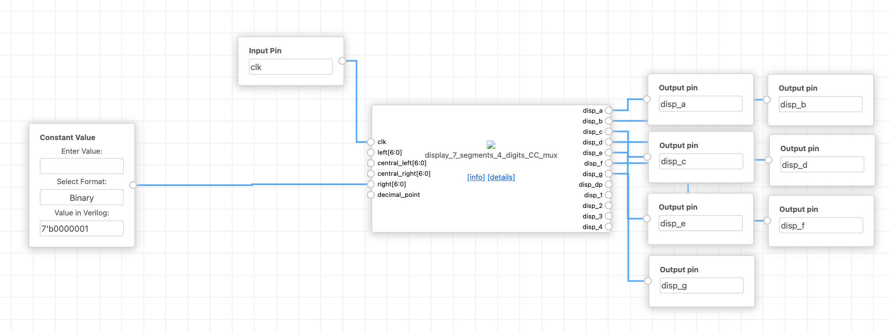
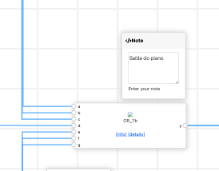
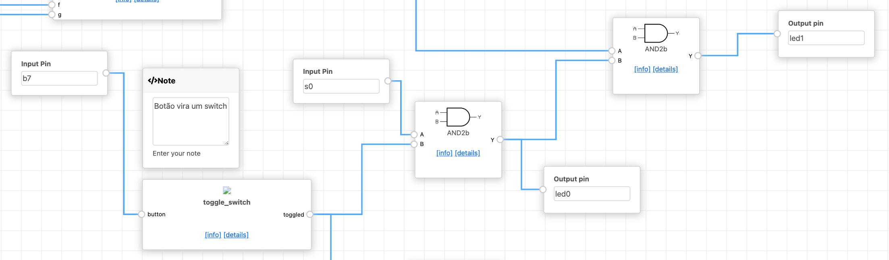

# MID-Keyboard
Not a MIDI keyboard

---

# Projeto "Teclado MID"

    

---

## **Sumário**
1. [Introdução](#introdução)
2. [Funcionalidades Implementadas](#funcionalidades-implementadas)
   - [Mapeamento de Frequências em Formato MIDI](#mapeamento-de-frequências-em-formato-midi)
   - [Sistema de Loop com Gravação e Reprodução](#sistema-de-loop-com-gravação-e-reprodução)
   - [Envio de Mensagens via UART](#envio-de-mensagens-via-uart)
   - [Identificação das Notas no Display de 7 Segmentos](#identificação-das-notas-no-display-de-7-segmentos)
   - [Combinações de Notas com Porta OR Customizada](#combinações-de-notas-com-porta-or-customizada)
   - [Botão como Switch](#botão-como-switch)
3. [Descrição Técnica](#descrição-técnica)
4. [Conclusão](#conclusão)

---

## **Introdução**

Nosso objetivo com o projeto foi expandir as funcionalidades do **pianinho** original, transformando-o em um teclado mais versátil e interativo. Para isso, tentamos implementar diversas features que vão desde o mapeamento de frequências em formato MIDI até a gravação e reprodução de sequências musicais.

---

## **Features**

### **Mapeamento de Frequências em Formato MIDI**
- Cada nota tocada no teclado é representada por uma mensagem no estilo do protocolo MIDI:
  - **Note On**: Indica o início da reprodução de uma nota.
  - **4 bits para Frequência**: Representa a nota específica (até 16 notas diferentes).
  - **Note Off**: Indica o fim da reprodução de uma nota.
- Esse mapeamento permite uma representação compacta e padronizada das notas, facilitando futuras integrações com sistemas MIDI.

---

### **Sistema de Loop com Gravação e Reprodução**
- O oitavo botão do teclado ativa o modo de gravação:
  - Ao pressionar o botão pela primeira vez, o sistema começa a gravar as mensagens MIDI geradas pelas notas tocadas.
  - Ao pressionar novamente, o sistema para a gravação e inicia a reprodução automática da sequência gravada.
- As mensagens são armazenadas em um bloco de memória (BRAM) com uma taxa de amostragem específica (e.g., 10 kHz). Isso significa que os eventos são registrados em intervalos regulares para garantir a precisão temporal durante a reprodução.

    

---

### **Envio de Mensagens via UART**
- As mensagens MIDI gravadas podem ser enviadas para um computador ou outro dispositivo externo via **UART**.
- Essa funcionalidade permite salvar as sequências musicais criadas no teclado para uso posterior ou processamento adicional.

    

---

### **Identificação das Notas no Display de 7 Segmentos**
- As notas tocadas são identificadas e exibidas em tempo real no display de 7 segmentos.
- Isso fornece feedback visual imediato ao usuário, mostrando qual nota está sendo tocada.

    

---

### **Combinações de Notas com Porta OR Customizada**
- Um módulo customizado de porta OR foi desenvolvido para permitir combinações de notas.
- Quando dois ou mais botões são pressionados simultaneamente, o som resultante é uma combinação das frequências correspondentes, gerando um som único e personalizado.

    

---

### **Botão como Switch**
- Um dos botões foi configurado para funcionar como um **switch**, alternando entre dois estados lógicos (`0` ↔ `1`) a cada pressionamento.
- Essa funcionalidade foi implementada usando um **T flip-flop** combinado com detecção de borda positiva.
- O estado do switch pode ser usado para controlar recursos como:
  - Alternar entre modos (gravação/reprodução).
  - Ativar/desativar funcionalidades específicas.
  - Controlar o estado de LEDs ou outros dispositivos.

    

---

## **Descrição Técnica**

### **Arquitetura Geral**
- **Clock Principal**: Operando a **27 MHz**, o clock é dividido para gerar uma taxa de amostragem de **10 kHz**.
- **Memória BRAM**: Utilizamos 20 KB de memória para armazenar até ~7447 eventos MIDI (cada evento consome 22 bits: 16 bits de timestamp + 4 bits de nota + 2 bits de status).
- **Buffer Circular**: A memória é organizada como um buffer circular, permitindo gravação e reprodução contínuas sem perda de dados.

### **Fluxo de Dados**
1. **Gravação**:
   - Os eventos MIDI (`Note On`, `Note Off`) são capturados e armazenados na memória BRAM.
   - Cada evento inclui um timestamp, a nota tocada e o status.
2. **Reprodução**:
   - Os eventos gravados são lidos sequencialmente da memória e reproduzidos no buzzer.
3. **Envio via UART**:
   - As mensagens gravadas podem ser transmitidas para dispositivos externos usando o protocolo UART.

### **Módulos Principais**
- **Divisor de Clock**: Reduz a frequência do clock principal para uma taxa de amostragem adequada.
- **Gravador de Notas**: Gerencia a gravação e reprodução dos eventos MIDI.
- **Display de 7 Segmentos**: Exibe as notas tocadas em tempo real.
- **Porta OR Customizada**: Combina múltiplas frequências para criar sons únicos.
- **Botão como Switch**: Implementado com um T flip-flop e detecção de borda positiva.

---

## **Conclusão**

- Expansão das funcionalidades: gravação e reprodução de sequências, envio MIDI via UART, exibição de notas no display de 7 segmentos e combinações de notas com módulo OR.
- Ferramenta experimental: mais do que um teclado simples, tornou-se um meio para criação e experimentação musical digital.
- Nome “MID”: referência ao protocolo MIDI e ao caráter intermediário do projeto, destacando sua proposta educativa.

### Sobre a plataforma Chip Inventor

- Visualização clara das conexões: facilitou a compreensão do circuito a ser sintetizado.
- Colaboração e reutilização de blocos: acelerou o desenvolvimento e reduziu a curva de aprendizado.
- Foco no diferencial do projeto: permitiu otimizar tempo e esforços nas inovações.

#### Melhorias propostas

- Habilidade de selecionar mais de um bloco, duplicar, etc
- Documentação mais clara sobre cada módulo implementado
- Nomenclatura melhor padronizada
- Erros na simulação
- Possibilidade de colaboração em conjunto, não apenas visualização

## **Melhorias para o projeto**

- Implementação completa de um protocolo MIDI para permitir a integração completa ao computador.
- Suporte a uma maoir quantidade de teclas e mais futuramente ainda, notas musicais.
- Visualização (display de 7 segmentos) de todas as notas possíveis.

---
